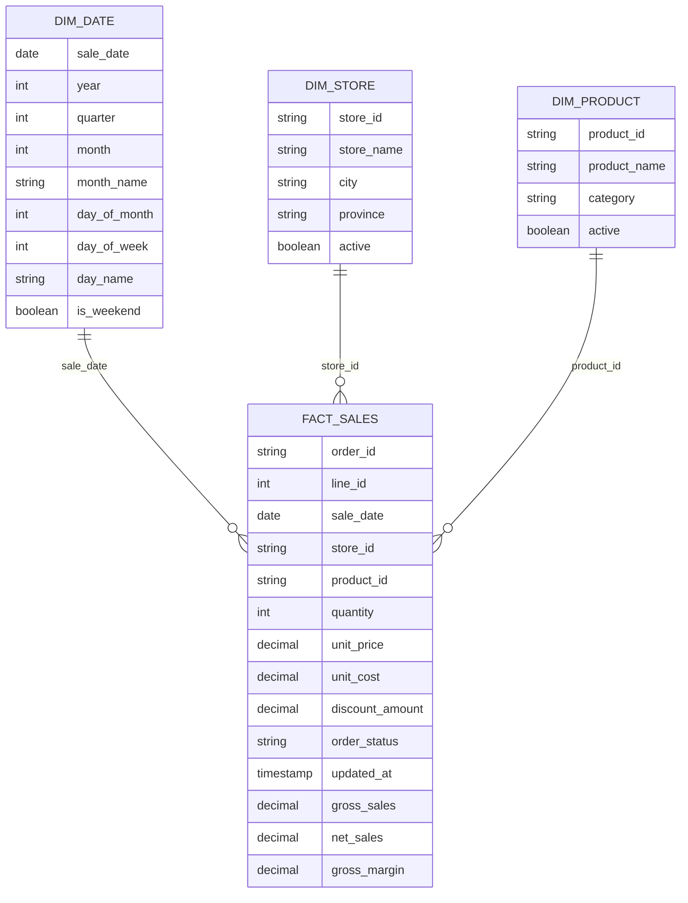

# P001 — Analytical Model

**Client:** Inflation Retail Group (`C001`)  
**Engagement:** `P001-retail-sales`  
**Model status:** Initial local analytical model design  
**Model type:** Current-state star schema

## Purpose

Define the first analytical model produced from P001's trusted current-state sales data.

The model is intentionally small:

```text
              dim_date
                  |
                  |
dim_store --- fact_sales --- dim_product
```

The objective is to make the trusted pipeline output easy to query while preserving the business semantics already established by the client data contracts and P001 resolution logic.

## Modeling Principle

P001 currently maintains the latest trusted state of each logical sales order line.

Therefore:

> `fact_sales` is a **current-state fact table**, not a full version-history fact table.

For a business key:

```text
(order_id, line_id)
```

only the latest trusted version appears in `fact_sales`.

Older superseded versions remain recoverable from source/raw history, while unresolved latest-version conflicts remain outside the trusted fact table in `ambiguous_state`.

## Relationship Model



## `fact_sales`

### Grain

One row represents:

> one current trusted retail order line

Business key:

```text
(order_id, line_id)
```

This is the same logical grain already established by the sales data contract and P001 version-resolution logic.

### Columns

| Column | Type | Role | Meaning |
| --- | --- | --- | --- |
| `order_id` | string | Business key | Retail order identifier. |
| `line_id` | integer | Business key | Line identifier within the order. |
| `sale_date` | date | Dimension reference | Business date of the sale. |
| `store_id` | string | Dimension reference | Store associated with the order line. |
| `product_id` | string | Dimension reference | Product associated with the order line. |
| `quantity` | integer | Measure input | Positive for completed sales, negative for returns. |
| `unit_price` | decimal(12,2) | Measure input | Selling price per unit before line-level discount. |
| `unit_cost` | decimal(12,2) | Measure input | Cost per unit. |
| `discount_amount` | decimal(12,2) | Measure input | Total line-level discount. |
| `order_status` | string | Business state | `COMPLETED`, `CANCELLED`, or `RETURNED`. |
| `updated_at` | timestamp | Version metadata | Timestamp of the authoritative source version. |
| `gross_sales` | decimal(24,2) | Measure | Gross sales contribution. |
| `net_sales` | decimal(24,2) | Measure | Gross sales less discount. |
| `gross_margin` | decimal(24,2) | Measure | Net sales less line cost. |

### Excluded Columns

The analytical fact table should not expose implementation-only fields such as:

```text
raw_*
rejection_reasons
```

Those fields remain useful inside processing and exception-state datasets, but they do not belong in the trusted analytical fact table.

### Status Semantics

`COMPLETED` rows contribute normal positive sales measures.

`RETURNED` rows use negative quantity, so the same formulas reverse the sale and associated margin contribution.

`CANCELLED` rows remain valid current business-state records but contribute:

```text
gross_sales = 0.00
net_sales = 0.00
gross_margin = 0.00
```

## `dim_product`

### Grain

One row represents:

> one currently known canonical product

Primary/natural key:

```text
product_id
```

### Columns

| Column | Type | Meaning |
| --- | --- | --- |
| `product_id` | string | Stable canonical product identifier. |
| `product_name` | string | Human-readable product name. |
| `category` | string | Product reporting category. |
| `active` | boolean | Whether the product is currently active. |

Inactive products remain valid dimension rows so historical/current trusted sales can continue to resolve to them.

### History Model

P001 does not currently implement slowly changing dimensions.

`dim_product` therefore represents the current canonical product attributes supplied to the run.

No surrogate key is introduced at this stage because the current requirements do not need historical product versions.

## `dim_store`

### Grain

One row represents:

> one currently known canonical retail store

Primary/natural key:

```text
store_id
```

### Columns

| Column | Type | Meaning |
| --- | --- | --- |
| `store_id` | string | Stable canonical store identifier. |
| `store_name` | string | Human-readable store name. |
| `city` | string | Store city. |
| `province` | string | Canadian province or territory code. |
| `active` | boolean | Whether the store is currently active. |

Inactive stores remain valid dimension rows.

### History Model

P001 does not currently implement slowly changing dimensions.

`dim_store` therefore represents the current canonical store attributes supplied to the run.

No surrogate key is introduced at this stage.

## `dim_date`

### Grain

One row represents:

> one calendar date represented by trusted sales data

Primary key:

```text
sale_date
```

### Columns

| Column | Type | Meaning |
| --- | --- | --- |
| `sale_date` | date | Calendar/business date. |
| `year` | integer | Calendar year. |
| `quarter` | integer | Calendar quarter number, 1–4. |
| `month` | integer | Calendar month number, 1–12. |
| `month_name` | string | Calendar month name. |
| `day_of_month` | integer | Day number within month. |
| `day_of_week` | integer | Spark/SQL-compatible weekday number. |
| `day_name` | string | Weekday name. |
| `is_weekend` | boolean | Whether the date falls on Saturday or Sunday. |

The first implementation may derive this dimension from the trusted sales dates present in the current state.

A broader reusable client calendar can be introduced later if another engagement requires it.

## Keys and Relationships

P001 initially uses natural business keys rather than surrogate warehouse keys.

```text
fact_sales.sale_date   -> dim_date.sale_date
fact_sales.store_id    -> dim_store.store_id
fact_sales.product_id  -> dim_product.product_id
```

The fact-table business key remains:

```text
(order_id, line_id)
```

This avoids adding surrogate-key machinery before a concrete slowly-changing-dimension or warehouse requirement justifies it.

## Current-State Semantics

The analytical model reflects the same current-state resolution semantics as the pipeline.

For example:

```text
older trusted version
        ↓
newer valid correction
        ↓
older version disappears from current fact_sales
        ↓
newer version becomes the current fact row
```

If the latest versions are ambiguous:

```text
conflicting latest versions
        ↓
ambiguous_state
        ↓
no fact_sales row for that business key
```

A later uniquely newer version may restore that key to trusted current state.

## Source-to-Model Mapping

```text
validated trusted products
        ↓
dim_product

validated trusted stores
        ↓
dim_store

resolved_state
        ↓
add_sales_metrics
        ↓
select analytical columns
        ↓
fact_sales

fact_sales.sale_date
        ↓
derive calendar attributes
        ↓
dim_date
```

## Analytical Questions Supported

This model is intended to support questions such as:

- gross and net sales by day;
- gross margin by day;
- sales by store;
- sales by city or province;
- sales by product;
- sales by category;
- returned sales impact;
- cancelled-line counts;
- unit volumes;
- order counts; and
- average order value.

## Deferred Modeling Decisions

The following are intentionally not part of the first model:

- surrogate dimension keys;
- slowly changing dimensions;
- effective-dated product/store history;
- separate return fact tables;
- separate cancellation fact tables;
- customer dimensions;
- promotion dimensions;
- inventory facts;
- streaming/event history;
- a shared enterprise calendar dimension; and
- generalized warehouse-model frameworks.

These should be introduced only when a real requirement makes them useful.

## Implementation Boundary

The next implementation step should create analytical-model functions that build:

```text
fact_sales
dim_product
dim_store
dim_date
```

from already validated/resolved P001 DataFrames.

The model-building code should not duplicate validation or version-resolution logic.

Recommended module:

```text
src/p001_retail_sales/modeling.py
```

Recommended tests:

```text
tests/test_modeling.py
```

After the model functions are proven independently, P001 can decide how to persist these analytical datasets locally and later map them to BigQuery.
