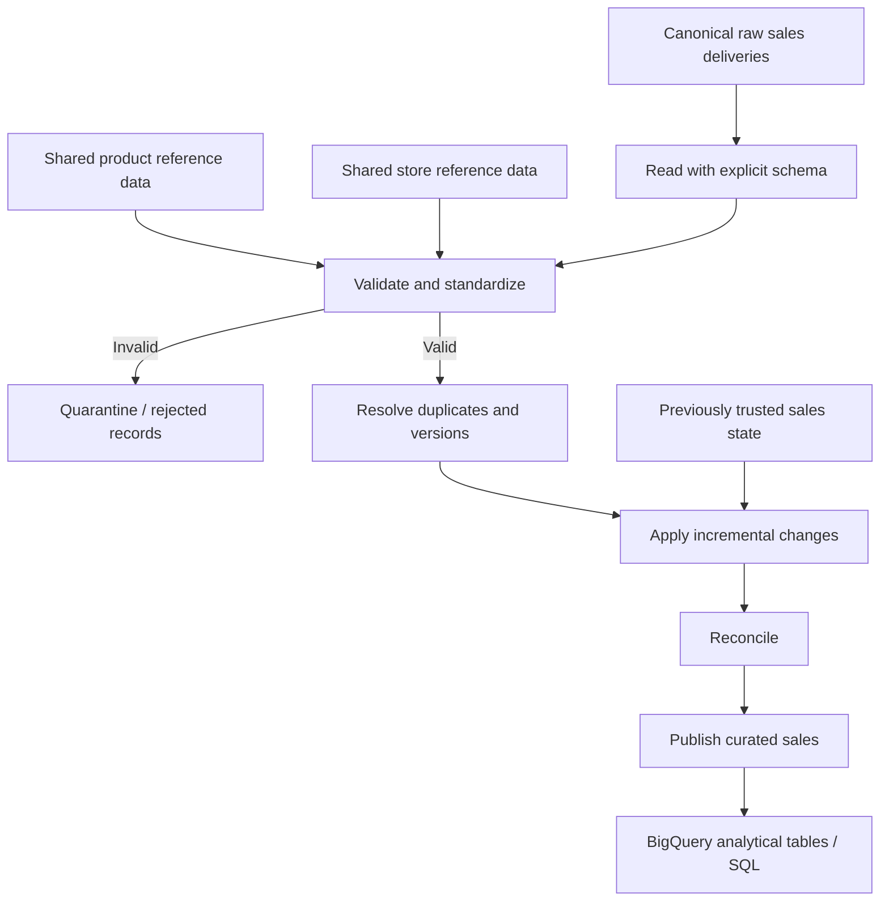

# P001 — Retail Sales Technical Architecture

**Client:** Inflation Retail Group (`C001`)  
**Engagement:** `P001-retail-sales`  
**Status:** Architecture definition  
**Implementation:** Not started

## Architecture Goal

Implement a small, production-minded batch data pipeline that converts canonical retail sales deliveries into trusted analytical outputs.

The design should prioritize the engineering skills most relevant to this engagement:

- PySpark transformations;
- SQL;
- schema enforcement;
- data-quality validation;
- referential integrity;
- deduplication and correction handling;
- incremental and idempotent processing;
- late-arriving data;
- reconciliation;
- partition-aware storage;
- BigQuery-ready analytical modeling; and
- clear operational failure behaviour.

The architecture should remain simple enough to understand end to end.

## System Boundary

`P001-retail-sales` does **not** own the client's canonical source data.

It consumes client-owned datasets defined under:

```text
clients/C001-inflation-retail-group/data-contracts/
├── sales.md
├── products.md
└── stores.md
```

The engagement owns:

- processing logic;
- engagement-specific validation;
- rejected-record handling;
- incremental state;
- curated analytical outputs;
- tests;
- reconciliation logic; and
- engagement documentation.

## Logical Data Flow



## Processing Model

P001 uses **daily incremental batch processing**.

Each run processes one source delivery and updates the trusted analytical state.

A run must be deterministic with respect to:

```text
source input
+ prior trusted state
+ reference data
+ business rules
```

Reprocessing the same successful delivery must not double-count sales or otherwise change the final trusted result solely because the batch was replayed.

## Data Layers

### 1. Canonical Raw

Owned by the client data estate.

Contains source deliveries as received, with no engagement-specific transformation.

P001 treats canonical raw data as immutable input.

Example logical location:

```text
canonical-raw/
└── sales/
    └── delivery_date=YYYY-MM-DD/
```

This is a logical convention only. Exact cloud paths will be chosen during implementation.

### 2. Standardized / Validated

Contains records after:

- explicit type parsing;
- required-field validation;
- business-rule validation;
- product referential-integrity checks;
- store referential-integrity checks; and
- normalization required by the data contract.

This layer is not yet the final analytical state because duplicate and competing record versions may still need resolution.

### 3. Rejected / Quarantine

Contains records that fail validation.

Each rejected record should preserve:

- original identifying fields;
- source metadata;
- one or more rejection reason codes; and
- enough context to investigate the failure.

Rejected rows must never silently disappear.

Example reasons may include:

```text
MISSING_ORDER_ID
INVALID_LINE_ID
UNKNOWN_PRODUCT_ID
UNKNOWN_STORE_ID
INVALID_ORDER_STATUS
INVALID_QUANTITY
INVALID_MONETARY_VALUE
AMBIGUOUS_VERSION
```

The final reason-code vocabulary will be defined alongside implementation and tests.

### 4. Curated

Contains the current trusted analytical representation of sales.

At minimum, curated sales must support:

- one current logical state per `(order_id, line_id)`;
- deterministic correction handling;
- reproducible revenue, units, order, and margin metrics;
- enrichment with product and store attributes; and
- downstream SQL analysis.

## Incremental Record Resolution

The business key is:

```text
(order_id, line_id)
```

Version precedence is based on:

```text
updated_at
```

For each business key:

1. exact redeliveries must not create additional logical records;
2. a newer valid `updated_at` supersedes an older version;
3. an older delivered version must not overwrite newer trusted state;
4. conflicting rows with the same business key and same `updated_at` are ambiguous and must be quarantined rather than resolved arbitrarily.

The implementation must produce the same final state regardless of harmless source replay.

## Late-Arriving Data

`sale_date` is the business date.

A record may legitimately arrive after its `sale_date`.

Processing must therefore separate:

```text
business date
```

from:

```text
delivery / ingestion date
```

A valid late-arriving record must update the appropriate analytical business period without being rejected merely because it arrived late.

## Publication Model

P001 should use a simple **stage → validate → publish** workflow.

```text
process batch
    ↓
write staged candidate output
    ↓
run reconciliation checks
    ↓
publish trusted state only if checks pass
```

A failed run must not replace the last known-good curated state.

This project does not attempt to implement a distributed transaction system.

The goal is to demonstrate safe publication semantics appropriate to a batch data-engineering exercise.

## Reconciliation

Before publication, the pipeline should verify invariants such as:

- no duplicate curated business keys;
- no unresolved invalid foreign keys;
- expected accepted/rejected counts reconcile to processed input;
- no ambiguous record versions enter curated data;
- derived monetary values are internally consistent; and
- rerunning the same delivery preserves the same trusted result.

Exact reconciliation checks will be implemented as testable rules.

## Storage Strategy

### Development

Use local Parquet for fast iteration and testing.

Parquet is preferred because it provides:

- columnar storage;
- explicit typed data;
- compatibility with Spark;
- predicate and column pruning opportunities; and
- a useful bridge to distributed analytical systems.

### GCP Execution

The cloud-equivalent architecture is:

```text
Cloud Storage
    ↓
PySpark batch processing
    ↓
Cloud Storage curated / rejected outputs
    ↓
BigQuery analytical tables
```

A managed Spark service such as Dataproc may execute the PySpark workload.

The architecture does not require cloud deployment before the core pipeline is correct locally.

## BigQuery Boundary

BigQuery is the analytical warehouse target.

P001 should eventually expose a compact analytical model rather than copying raw source structures directly into reporting tables.

The minimum useful model is expected to include:

```text
fact_sales
dim_product
dim_store
dim_date
```

The precise warehouse schema will be defined after the processing pipeline's trusted grain and transformation rules are finalized.

Do not introduce surrogate keys or slowly changing dimensions unless a concrete requirement justifies them.

## Partitioning

Partitioning should follow actual access and processing patterns rather than being added automatically.

Likely candidates:

```text
raw / standardized input:
    delivery_date

curated / warehouse sales:
    sale_date
```

The implementation should demonstrate:

- partition pruning;
- avoiding unnecessary shuffles;
- deliberate use of `repartition()` versus `coalesce()`; and
- awareness of small-file problems.

Partition choices must be validated with evidence rather than treated as universal rules.

## Planned Repository Structure

Only create directories when implementation begins.

The intended structure is:

```text
clients/
└── C001-inflation-retail-group/
    ├── data-contracts/
    │   ├── README.md
    │   ├── sales.md
    │   ├── products.md
    │   └── stores.md
    └── engagements/
        └── P001-retail-sales/
            ├── README.md
            ├── ARCHITECTURE.md
            ├── config/
            │   └── p001.yaml
            ├── src/
            │   └── p001_retail_sales/
            │       ├── schemas.py
            │       ├── validation.py
            │       ├── transformations.py
            │       ├── incremental.py
            │       ├── reconciliation.py
            │       └── pipeline.py
            ├── sql/
            │   └── analytics.sql
            └── tests/
                ├── test_validation.py
                ├── test_transformations.py
                ├── test_incremental.py
                └── test_reconciliation.py
```

## Module Responsibilities

### `schemas.py`

Defines explicit implementation schemas corresponding to the canonical contracts.

It must not redefine business meaning that belongs in the client contracts.

### `validation.py`

Applies:

- required-field rules;
- domain rules;
- range rules;
- referential-integrity checks; and
- rejection reason generation.

### `transformations.py`

Contains deterministic business transformations and analytical derivations.

Examples:

```text
gross_sales
net_sales
gross_margin
```

### `incremental.py`

Owns:

- duplicate handling;
- version resolution;
- correction handling;
- stale-record handling; and
- idempotent incremental updates.

### `reconciliation.py`

Verifies candidate outputs before publication.

### `pipeline.py`

Coordinates the engagement workflow.

It should orchestrate reusable functions rather than contain all transformation logic itself.

### `sql/analytics.sql`

Contains warehouse-style analytical queries used to verify and demonstrate the resulting data model.

### `tests/`

Tests correctness at the level of individual rules and end-to-end processing behaviour.

## Configuration

`config/p001.yaml` should contain environment-specific or run-specific values only when implementation requires them.

Examples may include:

```text
run date
input locations
output locations
warehouse dataset
```

Business rules that define the meaning of the data should not be hidden in configuration merely to make them appear generic.

## Testing Priorities

The implementation must test at least:

1. valid sales acceptance;
2. each important rejection rule;
3. product referential integrity;
4. store referential integrity;
5. exact duplicate replay;
6. newer correction superseding an older version;
7. stale delivery not replacing newer state;
8. same-key same-timestamp ambiguity;
9. late-arriving records;
10. idempotent reruns;
11. reconciliation failures blocking publication; and
12. derived revenue and margin calculations.

## Operational Failure Behaviour

The pipeline must fail clearly when trusted output cannot be determined.

Examples:

```text
contract-breaking schema change
duplicate canonical product IDs
duplicate canonical store IDs
ambiguous sales versions
failed reconciliation
unreadable source delivery
write failure before publication
```

Failure should preserve the last known-good published state.

## Explicit Non-Goals

P001 will not initially include:

- streaming;
- Kafka or Pub/Sub;
- Airflow / Composer orchestration;
- Terraform;
- Kubernetes;
- generic metadata frameworks;
- generalized multi-client pipeline engines;
- machine learning;
- inventory processing; or
- speculative abstractions for future engagements.

These may be introduced later only when they solve a real requirement.

## Implementation Sequence

Implementation should proceed in this order:

```text
1. Create minimal package / test scaffold
2. Implement explicit schemas
3. Create deterministic seed data
4. Implement validation and quarantine
5. Implement transformations
6. Implement incremental/version resolution
7. Implement reconciliation
8. Wire the end-to-end pipeline
9. Add analytical SQL
10. Run locally with Parquet
11. Validate Spark execution behaviour
12. Add GCP execution / BigQuery only after local correctness
```

## Definition of Architecture Complete

Architecture definition is complete when the following are clear:

- source contracts;
- system boundary;
- trusted record grain;
- validation path;
- rejected-record path;
- duplicate and correction semantics;
- incremental processing model;
- publication model;
- reconciliation expectations;
- storage strategy;
- BigQuery boundary;
- repository structure; and
- implementation sequence.

No production implementation code is required at this stage.
