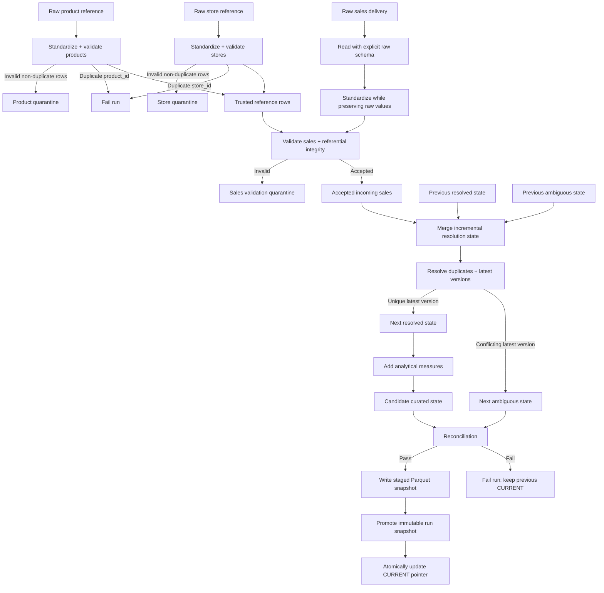

# P001 — Retail Sales Technical Architecture

**Client:** Inflation Retail Group (`C001`)  
**Engagement:** `P001-retail-sales`  
**Status:** Active implementation  
**Current stage:** Local incremental pipeline, reconciliation, and safe Parquet publication implemented

## Architecture Goal

Implement a small, production-minded batch data pipeline that converts canonical retail sales deliveries into trusted analytical state while making replay, corrections, ambiguity, quarantine, reconciliation, and failed publication behavior explicit.

The architecture prioritizes:

- explicit schemas;
- deterministic standardization;
- data-quality validation;
- referential integrity;
- duplicate and correction handling;
- incremental and idempotent processing;
- late-arriving data;
- persistent unresolved ambiguity;
- reproducible business metrics;
- reconciliation;
- safe publication;
- local Parquet persistence;
- testability; and
- a clean future mapping to GCP.

The design intentionally remains understandable end to end.

## System Boundary

`P001-retail-sales` does **not** own the client's canonical source data.

It consumes client-owned datasets defined under:

```text
clients/C001-inflation-retail-group/data-contracts/
├── sales.md
├── products.md
└── stores.md
```

P001 owns:

- ingestion behavior;
- canonical standardization;
- engagement-specific validation;
- rejected-record handling;
- duplicate/version resolution;
- incremental processing state;
- unresolved ambiguity state;
- analytical transformations;
- reconciliation;
- local publication state;
- tests; and
- engagement documentation.

## Current Logical Data Flow



## Processing Model

P001 uses **incremental batch processing**.

A run is deterministic with respect to:

```text
incoming source delivery
+ previous resolved state
+ previous unresolved ambiguity
+ current reference data
+ business rules
```

The previous resolved and ambiguous states are loaded from the last successfully published run.

Reprocessing a harmless delivery must not double-count sales or alter the logical trusted result solely because the batch was replayed.

## Reference-Data Processing

Products and stores are standardized and validated before sales referential-integrity checks.

Two reference-data failure classes are treated differently.

### Invalid non-duplicate reference row

Examples include missing descriptive values, invalid province, or unparseable `active`.

The reference row is quarantined and is not allowed to satisfy sales referential integrity.

A sales row referencing that invalid reference therefore receives the appropriate unknown-reference rejection reason.

### Duplicate reference identity

Duplicate canonical `product_id` or `store_id` values make identity ambiguous.

The pipeline fails the run rather than choosing one reference row arbitrarily.

## Standardization

Raw CSV values are read with explicit raw schemas and then standardized.

Standardization performs operations such as:

- trimming;
- safe integer parsing;
- safe date/timestamp parsing;
- decimal parsing;
- status normalization; and
- boolean normalization.

Source values are retained in `raw_*` columns so parse failures remain diagnosable.

Standardization does not decide whether a row is trustworthy.

## Validation and Quarantine

Validation answers:

> Is this individual row valid enough to participate in trusted processing?

Sales validation includes:

- required identifiers;
- positive `line_id`;
- parseable business date;
- quantity/status semantics;
- nonnegative monetary inputs;
- permitted order status;
- valid `updated_at`;
- completed-sale discount bounds; and
- product/store referential integrity.

The result is split into:

```text
accepted incoming rows
validation quarantine
```

Validation quarantine is historical/error evidence for the current run. It is not part of trusted current state.

## Incremental Resolution State

Version resolution answers a different question:

> Among individually trustworthy versions of the same business key, which latest state is authoritative?

The sales business key is:

```text
(order_id, line_id)
```

Version precedence is:

```text
updated_at
```

The resolution input is:

```text
previous resolved state
+ previous ambiguous state
+ accepted incoming rows
```

This is necessary because ambiguity is unfinished state, not merely historical quarantine.

## Duplicate and Version Resolution

Resolution follows this order:

1. collapse canonically identical redeliveries;
2. determine the maximum `updated_at` for each business key;
3. keep only rows at that latest timestamp;
4. after exact deduplication:
   - one latest canonical row becomes resolved;
   - multiple conflicting latest canonical rows become ambiguous.

The implementation must never choose a winner nondeterministically.

### Newer correction

A newer valid `updated_at` supersedes older state.

### Stale delivery

An older incoming version cannot replace newer known state.

### Exact replay

A canonically identical replay collapses and does not create another logical record.

### Same-timestamp conflict

Conflicting rows with the same business key and same latest `updated_at` are excluded from trusted state and receive:

```text
AMBIGUOUS_LATEST_VERSION
```

### Persisted ambiguity

Ambiguous latest rows are carried into the next run.

This prevents a later replay of only one side of the conflict from accidentally turning the key back into trusted state.

A genuinely newer unique version supersedes the older conflict and can return the key to trusted state.

## Resolved State Versus Curated State

P001 intentionally separates:

```text
resolved_state
```

from:

```text
curated_sales
```

`resolved_state` is the canonical current business state used as incremental input to the next run.

`curated_sales` is produced from `resolved_state` by adding analytical measures and passing reconciliation.

The pipeline does not feed the transformed curated dataset back into version resolution.

## Business Transformations

For `COMPLETED` and `RETURNED` rows:

```text
gross_sales  = quantity * unit_price
net_sales    = gross_sales - discount_amount
gross_margin = net_sales - (quantity * unit_cost)
```

For `CANCELLED` rows:

```text
gross_sales  = 0.00
net_sales    = 0.00
gross_margin = 0.00
```

The implemented metric type is:

```text
decimal(24,2)
```

The current transformation layer is deliberately narrow. Final warehouse enrichment and dimensional modeling remain future work.

## Reconciliation

Reconciliation verifies candidate output; it does not mutate business state.

The implemented checks include:

- validated incoming row count equals accepted plus validation-quarantined rows;
- no duplicate curated `(order_id, line_id)` keys;
- no row with rejection reasons appears in the candidate;
- no ambiguous key appears in the candidate;
- candidate and resolved-state business-key sets match;
- required metric columns exist; and
- analytical measures independently recompute to the expected values.

A reconciliation failure prevents publication.

## Publication Model

Local publication uses:

```text
process
    ↓
reconcile
    ↓
write complete staged snapshot
    ↓
promote staged directories to immutable run directories
    ↓
atomically replace CURRENT pointer
```

The authoritative switch is the `CURRENT` pointer.

A new run does not become authoritative until all trusted and quarantine datasets have been written and promoted successfully.

If processing or writing fails before `CURRENT` changes, the previous successful run remains authoritative.

## Local Storage Layout

Development publication uses:

```text
data/dev/
├── output/
│   ├── CURRENT
│   ├── _staging/
│   └── runs/
│       └── <run_id>/
│           ├── resolved_state/
│           └── curated_sales/
│
└── quarantine/
    ├── _staging/
    └── runs/
        └── <run_id>/
            ├── ambiguous_state/
            ├── sales_validation/
            ├── products/
            └── stores/
```

### `resolved_state`

Persistent canonical state required for the next incremental run.

### `curated_sales`

Transformed, reconciled analytical state for the published run.

### `ambiguous_state`

Persistent unresolved latest-version conflicts required by future resolution.

### Validation/reference quarantine

Run-specific rejected source/reference records retained for investigation.

## Batch-Job Coordination

`job.py` performs the persistent lifecycle:

```text
load CURRENT run state
    ↓
run in-memory pipeline
    ↓
reconcile candidate
    ↓
publish new snapshot
    ↓
update CURRENT
```

Business rules remain outside `job.py`.

## Late-Arriving Data

`sale_date` is the business date.

A record may legitimately arrive after its `sale_date`.

The pipeline separates business date from delivery/run identity, so a valid late-arriving row is not rejected merely because it arrived later.

Version precedence remains based on `updated_at`, not file-arrival order.

## Current Repository Structure

```text
P001-retail-sales/
├── README.md
├── ARCHITECTURE.md
├── pyproject.toml
├── config/
│   ├── base.yaml
│   ├── dev.yaml
│   ├── test.yaml
│   └── prod.yaml
├── data/
│   └── test/
│       └── input/
├── src/
│   └── p001_retail_sales/
│       ├── __init__.py
│       ├── schemas.py
│       ├── ingestion.py
│       ├── standardization.py
│       ├── validation.py
│       ├── resolution.py
│       ├── incremental.py
│       ├── transformations.py
│       ├── reconciliation.py
│       ├── pipeline.py
│       ├── publication.py
│       └── job.py
├── sql/
│   └── analytics.sql
└── tests/
    ├── conftest.py
    ├── test_ingestion.py
    ├── test_standardization.py
    ├── test_validation.py
    ├── test_resolution.py
    ├── test_transformations.py
    ├── test_incremental.py
    ├── test_reconciliation.py
    ├── test_pipeline.py
    ├── test_publication.py
    └── test_job.py
```

## Module Responsibilities

### `schemas.py`

Defines explicit raw and canonical implementation schemas corresponding to client contracts.

### `ingestion.py`

Reads raw CSV datasets without applying business validation.

### `standardization.py`

Produces canonical representations while preserving original `raw_*` values for traceability.

### `validation.py`

Applies row rules, reference-data rules, referential integrity, rejection reasons, and accepted/quarantine splitting.

### `resolution.py`

Owns exact canonical redelivery collapse and latest-version classification.

### `incremental.py`

Combines previous resolved state, previous ambiguous state, and accepted incoming rows before calling resolution.

### `transformations.py`

Adds deterministic analytical measures.

### `reconciliation.py`

Verifies candidate publication invariants and raises on unsafe output.

### `pipeline.py`

Coordinates the in-memory workflow and returns a `SalesPipelineResult`.

### `publication.py`

Persists local Parquet snapshots, loads current state, and owns the safe `CURRENT` publication pointer.

### `job.py`

Coordinates one complete persistent batch job:

```text
load → process → reconcile → publish
```

### `sql/analytics.sql`

Currently a placeholder. Warehouse-style analytical SQL will be added after the trusted analytical model is finalized.

## Environment Model

P001 explicitly separates:

```text
dev
test
prod
```

Configuration files exist under:

```text
config/
├── base.yaml
├── dev.yaml
├── test.yaml
└── prod.yaml
```

The intended resolution model remains:

```text
base.yaml
    +
<environment>.yaml
    =
effective configuration
```

However, the current runtime does **not** yet implement automatic YAML loading/merging. The local job currently receives paths and `run_id` explicitly.

Production storage and BigQuery values remain intentionally unresolved.

## Testing Model

P001 has automated coverage for:

- explicit ingestion;
- standardization and parse behavior;
- row-level and reference validation;
- quarantine behavior;
- referential integrity;
- exact redelivery;
- newer corrections;
- stale versions;
- same-key/same-timestamp ambiguity;
- ambiguity persistence;
- ambiguity resolution by a newer version;
- derived metrics;
- reconciliation;
- pipeline integration;
- safe Parquet publication;
- state reload; and
- persistent multi-run job behavior.

The test suite is intentionally layered so algorithmic failures can be isolated before end-to-end behavior is tested.

## Operational Failure Behavior

### Run-blocking conditions

Examples include:

```text
duplicate canonical product IDs
duplicate canonical store IDs
failed reconciliation
unreadable input
failed Parquet write
corrupt/missing CURRENT state
```

These must not replace the last known-good published run.

### Row-level quarantine conditions

Invalid individual source/reference rows are retained in quarantine and do not silently enter trusted state.

### Ambiguous sales versions

Ambiguous latest sales versions do **not** automatically fail the entire run.

Instead:

```text
ambiguous key
    → excluded from trusted state
    → persisted in ambiguous_state
    → reconsidered on future runs
```

This is a deliberate correction to the earlier architecture assumption that every ambiguous sales version should fail the whole batch.

## Local Development Storage

Parquet is used locally because it provides:

- columnar typed storage;
- Spark compatibility;
- predicate and column pruning opportunities; and
- a useful bridge to object-storage/warehouse workflows.

Generated local output, quarantine, staging, benchmark, scratch, and temporary data should remain outside Git.

## GCP Target Boundary

The local architecture is designed to map later to:

```text
Cloud Storage canonical input
        ↓
PySpark / Dataproc
        ↓
Cloud Storage trusted + quarantine state
        ↓
BigQuery analytical model
```

The exact GCP publication mechanism does not have to imitate the local filesystem pointer implementation literally. The invariant to preserve is:

> A partially failed run must not replace the last known-good published state.

Cloud implementation should use storage/warehouse mechanisms appropriate to GCS and BigQuery.

## BigQuery and Analytical Modeling

BigQuery remains the intended analytical warehouse target.

The expected minimum model remains:

```text
fact_sales
dim_product
dim_store
dim_date
```

This model is **not yet implemented**.

Reference-data enrichment, final curated schema selection, dimensional-model design, and analytical SQL remain upcoming work.

Do not introduce surrogate keys or slowly changing dimensions without a concrete requirement.

## Partitioning and Performance

Partitioning has not yet been finalized.

Likely future candidates include:

```text
source / standardized:
    delivery date

curated / warehouse sales:
    sale_date
```

The performance phase should provide evidence for:

- partition pruning;
- shuffle behavior;
- `repartition()` versus `coalesce()`;
- join strategy;
- skew;
- small-file behavior; and
- realistic batch-size performance.

Partition decisions should be measured rather than assumed.

## Explicit Non-Goals

P001 does not currently include:

- streaming;
- Kafka or Pub/Sub;
- Airflow / Composer;
- Terraform;
- Kubernetes;
- a generic metadata framework;
- a generalized multi-client engine;
- machine learning; or
- inventory processing.

These should be introduced only when a real requirement justifies them.

## Implementation Progress

Completed locally:

```text
1. Package/test scaffold
2. dev/test/prod configuration scaffold
3. Explicit schemas
4. Deterministic seed fixtures
5. Ingestion
6. Standardization
7. Validation and quarantine
8. Duplicate/version resolution
9. Persistent ambiguity handling
10. Business metrics
11. Incremental/idempotent state handling
12. Reconciliation
13. End-to-end in-memory pipeline
14. Safe local Parquet publication
15. Persistent batch-job coordination
```

Next:

```text
16. Exercise the job against real data/dev paths and inspect outputs
17. Finalize curated analytical shape / reference enrichment
18. Add analytical SQL
19. Validate Spark execution and performance behavior
20. Add realistic benchmark data
21. Map proven persistence/execution design to GCP
22. Add BigQuery analytical publication/model
```

## Definition of Current Local Milestone

The local core milestone is satisfied when P001 can:

- validate and quarantine bad data;
- maintain deterministic current state across deliveries;
- preserve unresolved ambiguity;
- survive harmless replay;
- derive reproducible sales metrics;
- reconcile a candidate before publication;
- persist the next state to Parquet;
- keep immutable run snapshots; and
- preserve the last known-good published state if a later run fails.

Those behaviors are now represented in the implementation and automated test suite.
